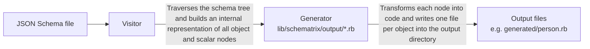

# schematrix

> Generate Ruby code and RBS signatures from JSON Schema definitions.

`schematrix` is a Ruby gem and CLI tool that reads [JSON Schema](https://json-schema.org/) files and produces idiomatic Ruby source code. Point it at a schema, choose a generator, and get ready-to-use Ruby classes and type signatures written into your project.

---

## Requirements

- Ruby **≥ 3.1**
- Bundler (for gem installation)

---

## Installation

Add `schematrix` to your `Gemfile`:

```ruby
gem 'schematrix', '~> 0.1'
```

Then run:

```sh
bundle install
```

Or install it directly:

```sh
gem install schematrix
```

---

## Quick Start

Given this JSON Schema (`person.schema.json`):

```json
{
  "$schema": "https://json-schema.org/draft/2020-12/schema",
  "title": "Person",
  "type": "object",
  "properties": {
    "firstName": { "type": "string" },
    "lastName":  { "type": "string" },
    "age":       { "type": "integer" }
  },
  "required": ["firstName", "lastName"]
}
```

Run:

```sh
schematrix gen -g plain_ruby -m MyApp -o app/generated person.schema.json
```

This produces `app/generated/person.rb`:

```ruby
module MyApp
  class Person
    def initialize(first_name:, last_name:, age:)
      @first_name = first_name
      @last_name = last_name
      @age = age
    end

    attr_accessor :first_name, :last_name, :age
  end
end
```

---

## CLI Reference

```
Usage: schematrix gen [OPTIONS] INPUT [INPUT...]

Generate code matching a JSON Schema

Options:
  -g, --generators list  Output geretarots to use, i.e.: plain_ruby, rbs
  -h, --help             Print usage
  -m, --module string    Module where the output code will be placed
  -o, --output string    Directory where the output will be written (default
                         "generated")
  -v, --verbose          Each additional occurrence lowers logger level, -vvv
                         for the minimum
```

### Example usages

Generate plain Ruby classes for a single schema:

```sh
schematrix gen -g plain_ruby -m MyApp -o app/generated schema.json
```

Process multiple schemas at once:

```sh
schematrix gen -g plain_ruby -m Contracts user.schema.json order.schema.json
```

Or even:

```sh
schematrix gen -g plain_ruby -m Contracts *.schema.json
```

---

## Generators

### `plain_ruby`

Produces mutable Ruby classes. For each `object` type encountered in the schema (including nested objects), the generator:

1. Derives a **class name** from the schema `title` and the JSON path to the object, converted to PascalCase.
2. Converts all **property names** from camelCase to snake_case.
3. Emits a class with a **keyword-argument constructor** (`def initialize(prop_a:, prop_b:)`) and an `attr_accessor` for every property.
4. Writes one **file per object** into the output directory, with snake_case filenames.
5. Formats the source with **SyntaxTree**.

#### Nested objects

For a schema like `complex-object.schema.json`:

```json
{
  "title": "ComplexObject",
  "type": "object",
  "properties": {
    "name":    { "type": "string" },
    "address": {
      "type": "object",
      "properties": {
        "street":     { "type": "string" },
        "city":       { "type": "string" },
        "postalCode": { "type": "string" }
      }
    }
  }
}
```

The generator produces two files:

- `complex_object.rb` — the root class with `name` and `address` properties.
- `complex_object/address.rb` — a standalone `ComplexObject::Address` class.

---

## How It Works



The core components are:

- **`Schematrix::Visitor`** — walks the JSON Schema document tree depth-first, resolving `required` fields and dispatching on `type`.
- **`Schematrix::Object`** — represents an `object` node with its named properties.
- **`Schematrix::Schema`** — represents a scalar leaf node (`string`, `integer`, `boolean`, etc.).
- **`Schematrix::Array`** — represents an `array` node with its `items` type.
- **`Schematrix::Output::*`** — the code generators; handle source code production, formatting, and file I/O.
- **`Schematrix::CLI`** — the command-line interface, built on [`tty-option`](https://github.com/piotrmurach/tty-option).

---

## Development

Clone the repository:

```sh
git clone https://github.com/cinzatech/schematrix.git
cd schematrix
bundle install
```

Run the CLI from the project root:

```sh
bundle exec exe/schematrix gen -g plain_ruby -m Test -o /tmp/generated examples/basic.schema.json
```

Lint with RuboCop:

```sh
bundle exec rubocop
```

---

## Contributing

Please, feel free to send Pull Requests. Machine-generated code is acceptable as long as it meets our standards for code
quality and there's at least one human behind who understands the code being sent. We believe in code as theory
building, so we want contributions that strengthen the shared mental model, not weaken it.

---

## License

`schematrix` is released under the [GNU Affero General Public License v3.0 or later](LICENSE) (AGPL-3.0-or-later).